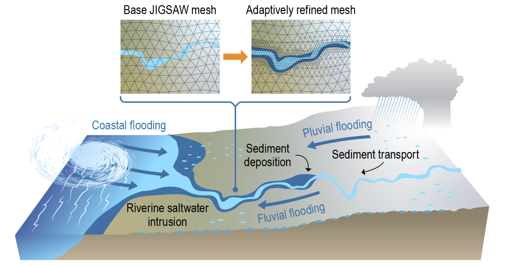

# Overview

Compound flooding (CF) poses significant risks to human and natural systems. 
It can impair basic infrastructure and threaten lives and livelihood. 
The urgent need for an improved predictive understanding of CF and its impact on 
sediment dynamics (SD) and riverine saltwater intrusion (rSWI) at global scales under
a future climate is well recognized. 

However, several shortcomings in the current version of the Department of Energy’s (DOE’s) 
[Energy Exascale Earth System Model (E3SM)](https:e3sm.org), 
including those related to model structure, lack of mechanistic representation of key processes, 
and coarse spatial resolution, pose limits. 
Efforts towards improved predictions using E3SM are also restricted by the lack of portability of 
the current E3SM’s river model on DOE’s exascale-class supercomputers, which have heterogeneous computing architectures.

The project objectives of this interdisciplinary research are to develop a 
rigorously verified and validated **river dynamical core (RDycore)** for E3SM, 
which includes efficient and scalable solvers for DOE’s exascale-class supercomputers, 
for the study of CF and its impacts on SD and rSWI in a changing climate.

### Acknowledgements

RDycore is funded by the US Department of Energy's (DOE's) Scientific Discovery Through Advanced Computing
([SciDAC](https://www.scidac.gov/)) program through a joint parternship between 
the DOE Office of Science's 
[Biological and Environmental Research](https://science.osti.gov/ber) and
[Advanced Scientific Computing](https://www.energy.gov/science/ascr/advanced-scientific-computing-research).

